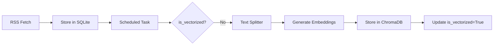
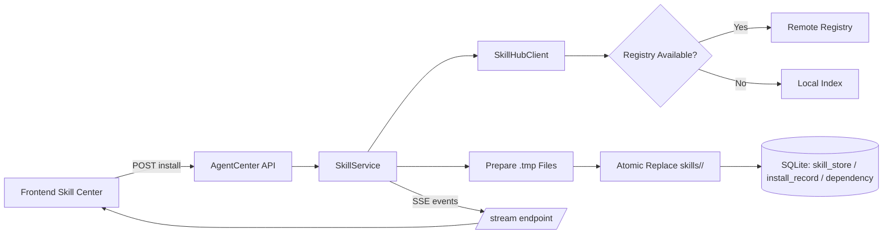
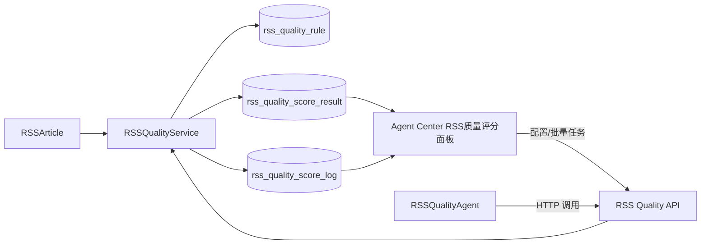

# System Architecture

## Overview
本项目是一个基于 RSS 订阅的智能信息聚合与对话平台。核心功能包括 RSS 订阅管理、文章自动向量化、语义搜索以及基于 LLM 的 AI 对话助手。

## Technology Stack
- **Backend**: FastAPI (Python 3.12)
- **Database**: SQLite (SQLModel/SQLAlchemy)
- **Vector Database**: ChromaDB (Embedded)
- **AI/LLM**: Ollama (Local), OpenAI, Anthropic (Supported via Provider)
- **Frontend**: Vue 3 + Vite
- **UI Framework**: Arco Design Vue
- **Task Scheduling**: APScheduler

## Core Modules

### 1. RSS Management (`app.api.rss`, `app.services.rss_service`)
- **Function**: Subscribe to RSS/Atom feeds, parse content, and store articles.
- **Models**: `RSSFeed`, `RSSArticle`
- **Automation**: Periodic background tasks fetch updates.

### 1.1 RSS Quality Scoring (`app.api.rss_quality`, `app.services.rss_quality_service`, `agents/agents/rss_quality_agent`)
- **Function**: 对 RSS 入库文章执行多维度质量评分，并输出综合质量报告。
- **Scoring Dimensions**:
  - `originality`: 基于内容哈希与分片相似度检测重复风险。
  - `information_value`: 基于关键词权重、正文深度与行业词库匹配评估信息价值。
  - `writing_quality`: 基于语法噪声、段落结构和句子长度分布评估写作质量。
  - `interaction_potential`: 基于标题强势词、数字/疑问句与热点关键词估算互动潜力。
  - `timeliness`: 基于发布时间衰减与新鲜度关键词评估时效性。
- **Data Model**:
  - `rss_quality_rule`: 保存可视化配置界面的权重、阈值和算法参数。
  - `rss_quality_score_result`: 持久化保存每次评分结果、维度分数、报告快照和批次号。
  - `rss_quality_score_log`: 保存批量任务与单篇文章评分日志，支持按批次追踪。
- **Processing**:
  - 批量评分接口：`POST /api/v1/agent-center/rss-quality/score`
  - 配置接口：`GET/PUT /api/v1/agent-center/rss-quality/config`
  - 结果筛选接口：`GET /api/v1/agent-center/rss-quality/results?min_score=&max_score=`
  - 日志接口：`GET /api/v1/agent-center/rss-quality/logs`
- **Frontend**:
  - Agent Center 新增 `RSS质量评分` 可视化面板，支持滑杆调整权重、阈值和批量任务参数。
  - 运营侧可直接查看评分结果、批次摘要和详细报告抽屉。

### 2. Vector Search (`app.api.vector`, `app.services.vector_service`)
- **Function**: Convert article content to vector embeddings for semantic search.
- **Workflow**:
  1.  Text Preprocessing (Title + Summary + Content)
  2.  Chunking (`RecursiveCharacterTextSplitter`)
  3.  Embedding (`sentence-transformers` via ChromaDB)
  4.  Storage in ChromaDB
- **Features**:
  - Batch ingestion (`POST /sync`)
  - **Enhanced Semantic Search (`GET /search`)**:
    - **Relevance Ranking**: Returns similarity scores (distance) for precise result ordering.
    - **Customizable Limits**: Supports 1-50 results per query.
    - **Metadata Enrichment**: Returns full article metadata and content snippets.
    - **Chinese Retrieval Tuning**:
      - Explicit sentence-transformers embedding model via `VECTOR_EMBEDDING_MODEL` (default: `BAAI/bge-base-zh-v1.5`).
      - Configurable chunk settings via `VECTOR_CHUNK_SIZE` and `VECTOR_CHUNK_OVERLAP` (defaults: 420/80).
      - Query normalization + multi-query fusion (raw normalized query + keyword variants) to improve Chinese recall.
      - Reduced template noise in indexed documents (title + content) while keeping keywords in metadata.
  - **Vector Admin Search Panel (`/vector/admin`)**:
    - Debounced asynchronous text search with request cancellation and 2s timeout protection.
    - Client-side result-size control (1-50) without re-requesting data after initial fetch.
    - Similarity-first result sorting, snippet truncation, loading/empty states, and paginated result browsing.
  - Data backup (`POST /backup`)
  - **Vector Admin**: Inspect collection stats and manage indices via `VectorAdmin.vue`.
- **Integration**: Articles are marked with `is_vectorized` flag to track status.

### 3. AI Chat System (`app.api.chat`, `app.services.chat_service`)
- **Function**: Multi-turn dialogue with AI.
- **Architecture**:
  - **Provider Pattern**: `AIProviderFactory` supports switching between Ollama, OpenAI, and Anthropic.
  - **Streaming**: Server-Sent Events (SSE) / StreamingResponse for real-time output.
  - **Session Management**: UUID-based sessions (`ChatSession`) and messages (`ChatMessage`).
  - **Search**: Search chat history by keywords or date.
- **Models**: `ChatSession` (UUID), `ChatMessage` (UUID, Role: user/assistant)

### 4. Intelligent Agent System (`agents/`)
- **Function**: Autonomous agents for specialized tasks (Data Analysis, Text Processing, Image Recognition, Workflow Orchestration).
- **Architecture**:
  - **Modular Design**: Each agent is an independent entity inheriting from `Agent` base class.
  - **Skill System**: Agents are composed of reusable `Skills` (e.g., DataCleaningSkill, SentimentAnalysisSkill).
  - **RESTful API**: Dedicated API (`agents/api/main.py`) for agent interaction and management.
  - **Collaboration**: `CollaborationManager` handles task decomposition and distribution among agents.
  - **LangGraph-CLI Runtime**: 主流程与协作流程迁移为 `agents/graph/` 下的图编排模型，通过 `langgraph.json` 暴露 `master_graph` 与 `collaboration_graph`，支持子图复用与节点级单测隔离。
  - **Purpose-Based Routing**: `MasterAgent` 支持根据 `parameters.purpose` 自动分流到 `article_query_agent`、`text_agent`、`data_agent`、`workflow_agent`，未指定 purpose 时先做 query 关键词识别，未命中再走轻量 LLM 分类兜底；`agent_name` 显式指定优先级最高。
- **Components**:
  - **Core**: Base `Agent`, `Skill`, `AgentManager`.
  - **Skills Registry**: Centralized registration and retrieval of skills.
  - **Implementations**: `DataAgent`, `TextAgent`, `ImageAgent`, `WorkflowAgent`.

### 5. Concurrency & Performance Optimization
- **Database (SQLite)**:
  - Enabled **WAL (Write-Ahead Logging)** mode to support concurrent readers and writers.
  - Mitigates "database is locked" errors during background fetching and vectorization.
- **Background Tasks**:
  - **Off-Main-Loop Execution**: Heavy synchronous IO/CPU tasks (RSS parsing, DB writes) are offloaded to thread pools using `run_in_threadpool` or synchronous functions in `BackgroundTasks`.
  - Ensures the main asyncio event loop remains responsive for API requests.
- **Query Optimization**:
  - **N+1 Problem Solved**: Use eager loading (`JOIN`) in list endpoints (e.g., `/articles/query`) to fetch related data in a single query.

### 6. Card Center (Dashboard)
- **Function**: 个人日常生活卡片中心，提供可自定义配置和拖拽布局的仪表盘，以及卡片创建/编辑/AI生成/发布的管理功能。
- **Components** (`frontend/src/pages/card-center/components/`):
  - `StockCard`: 股价趋势图表（ECharts K线图，支持缩放与数据缓存）。
  - `NewsCard`: 实时新闻资讯（分类筛选，列表展示）。
  - `WeatherCard`: 天气预报（当前天气、AQI、5天预报及城市切换）。
  - `TaskCard`: 任务管理（进度统计、优先级、截止日期、增删改查）。
  - `ReminderCard`: 提醒事项（周期性提醒、到期弹窗提示）。
  - `TodoCard`: 轻量级待办（支持内部拖拽排序与快速添加）。
- **Architecture**:
  - 纯原生 Vue3 + JS 实现，通过 `vuedraggable` 支持卡片网格的自由拖拽排序。
  - 所有卡片组件支持独立显隐控制，布局及可见性配置持久化存储在 `localStorage` 中。
  - 组件内部实现基于 `localStorage` 和时间戳的请求缓存机制，减少高频 API 调用。
- **卡片管理功能** (`frontend/src/pages/card-center/CardCenter.vue`):
  - **左侧边栏**: 卡片列表，支持选择、新建操作。
  - **右侧工作区**: 卡片编辑表单、AI代码生成器、代码编辑器、实时预览、版本保存与发布。
  - **AI 代码生成**: 通过 `generateCardCode` API 调用后端 AI 服务生成 Vue 组件代码。
  - **版本管理**: 支持多版本保存，通过 `createVersion` API 存储历史版本。
  - **发布功能**: 通过 `publishCard` API 将卡片代码物理写入 `frontend/packages/web/src/components/cards/generated/` 目录。

### 7. Structured Logging & Observability
- **Backend Logging** (`backend/app/core/logging_config.py`):
  - Unified JSON log format fields: `timestamp` (ISO-8601), `level`, `traceId`, `thread`, `className`, `message`, `exception`.
  - Trace propagation via `TraceIdMiddleware`; each request gets `X-Trace-Id`.
  - Daily directory layout: `backend/logs/YYYY-MM-DD/{application,error,access}.log`.
  - Dual rotation strategy:
    - Daily rotation (00:00 by date directory switch).
    - Size rotation (50 MB per file with incremental suffixes).
  - Retention policy: automatic cleanup of history older than 30 days.
  - Runtime log level control: `LOG_LEVEL` environment variable (TRACE/DEBUG/INFO/WARN/ERROR), effective without restart.
  - Degradation strategy: when disk is full (`ENOSPC`/`EDQUOT`), fallback to console output to avoid blocking core flow.
  - Container support: Docker/K8s environment auto-enables console appender for real-time log collection.

### 8. Agent Conversation Logging Pipeline
- **Conversation Log Storage** (`agents/core/conversation_logger.py`):
  - Root directory: `agents/logs/conversation/YYYY-MM-DD/`.
  - Per-session JSONL file: `sessionId.jsonl`.
  - Asynchronous write path:
    - In-memory queue: max 1000 entries.
    - Periodic flush: every 5 seconds.
    - Backpressure fallback: ring buffer (non-blocking) on queue/disk failure.
  - Sensitive data masking:
    - Built-in masking for Chinese mobile numbers, ID cards, and email addresses.
  - Upload capability:
    - API endpoint: `POST /api/v1/agents/logs/upload`.
    - Date-range packaging to `tar.gz` and upload to external analysis platform.
    - Configurable post-upload local deletion.
  - Query tooling:
    - `tools/search_agent_log.py` supports `sessionId`, `userId`, keyword, and time-range filtering with terminal highlight.

### 9. Local Dev Process Orchestration
- **Scripts** (`scripts/start-dev.sh`, `scripts/stop-dev.sh`, `scripts/status.sh`):
  - `.env`-driven port/service configuration.
  - Cross-platform (macOS/Linux) port detection and graceful process shutdown (`SIGTERM` then `SIGKILL` after timeout).
  - Dependency readiness checks for MySQL, Redis, MinIO.
  - Parallel startup and PID tracking under `pids/`.
  - Health probes for backend, agents, and frontend endpoints with fail-fast rollback.
  - Real-time colored terminal logs with persistent file output under `logs/`.

### 10. Agents/Backend Decoupling via Service Clients
- **Decoupling Goal**:
  - `agents` 与 `backend` 已移除双向直接代码导入，不再通过 `import/require` 直接引用对方实现。
  - 运行时通信统一通过 HTTP 接口调用。
- **Service Client Modules**:
  - `agents/service_client/`：封装 agents -> backend 的远程调用。
  - `backend/app/service_client/`：封装 backend -> agents 的远程调用。
- **API Versioning**:
  - 外部 API 继续使用 URL 版本：`/api/v1/...`。
  - 内部服务调用新增 Header 版本：`X-API-Version`，默认 `v1`。
- **Security**:
  - 内部接口支持 `SERVICE_AUTH_MODE=jwt|mtls|none`。
  - JWT 模式通过 `Authorization: Bearer <token>` 校验，token 来源 `SERVICE_JWT_TOKEN`。
  - mTLS 模式通过网关注入 `X-Client-DN` 进行身份校验。
- **Resilience & Observability**:
  - 客户端统一支持连接池、超时、重试、熔断、限流。
  - 统一注入 `X-Request-Id`、`traceparent`，兼容 OpenTelemetry 链路追踪。
  - 统一错误载荷格式：
    - `{"error":{"code":"...","message":"...","trace_id":"...","details":{...}}}`
- **Contract Tests**:
  - `agents/tests/test_contract_backend_client.py`
  - `agents/tests/test_agents_api_contract.py`
  - `backend/tests/test_contract_agents_client.py`
  - `backend/tests/test_internal_api_contract.py`

### 11. SkillHub Skill Management Pipeline (`app.api.agent_center`, `app.services.skill_service`)
- **Function**:
  - 提供 SkillHub 搜索、版本化安装、依赖解析、冲突处理（自动升级策略）、卸载与更新能力。
  - 安装路径固定为项目根目录 `skills/`，并维护 `skills/<skill>/<version>/` 结构。
- **Registry Strategy**:
  - 双模式搜索：优先 HTTP Registry（`SKILLHUB_REGISTRY_URL`），失败回退本地索引（`skills/skillhub-index.json`）。
  - 搜索维度：名称、标签、版本。
- **Data Model**:
  - `skill_store`: 技能主表（版本、来源、安装状态、依赖快照、幂等键、错误信息等）。
  - `skill_install_record`: 安装/升级/卸载记录（操作者、状态、结果、时间）。
  - `skill_dependency`: 依赖关系表（约束版本与解析版本）。
- **Installation Workflow**:
  1. 生成幂等键并查重。
  2. 拉取 Skill 与依赖元信息。
  3. 预写临时目录 `.tmp`。
  4. 原子替换安装目录并写库。
  5. 失败时回滚文件与数据库。
- **Realtime Progress**:
  - 使用 SSE 提供安装状态流：
    - `GET /api/v1/agent-center/skills/install/{task_id}/stream`
    - `GET /api/v1/agent-center/skills/install/{task_id}/status`
- **REST Response Contract**:
  - `agent-center` 全量接口统一返回：
    - `{"code": 0|非0, "msg": "...", "data": ...}`

### 11. Agent/Skill Catalog File Pipeline (`app.services.agent_center_catalog_service`)
- **Data Source**:
  - Agent 清单目录：`AGENT_DATA_PATH`（默认 `<project_root>/agents/agents`）。
  - Skill 清单目录：`SKILL_DATA_PATH`（默认 `<project_root>/agents/skills`）。
- **Load Strategy**:
  - 服务启动阶段执行递归扫描，解析 `.json/.yaml/.yml/.js/.ts/.py/.md`，统一输出字段：
    - `id`, `name`, `description`, `version`, `enabled`, `createdAt`, `updatedAt`
  - 对结构化文件解析失败返回 HTTP 422，并返回 `file + error` 明细。
  - 对重复 `id` 返回 HTTP 400，并返回冲突文件列表。
- **Cache & Concurrency**:
  - 采用内存缓存 + 读写锁保障并发读写安全。
  - 文件监听优先 `watchdog`，不可用时退化到轮询快照，支持新增/修改/删除后的自动热更新。
- **Error Logging**:
  - 运行异常写入 `backend/logs/agent-center-error.log`。
  - 采用按天滚动并保留 30 天策略。

## Data Flow

### Article Vectorization


### AI Chat
```mermaid
graph LR
    User -->|Message| API[Chat API]
    API -->|Save| DB[SQLite (History)]
    API -->|Context| Provider[AI Provider (Ollama/OpenAI)]
    Provider -->|Stream Token| API
    API -->|Stream Response| User
    API -->|Save Full Response| DB
```

### Skill Install (SSE)


### RSS Quality Scoring


## Directory Structure
```
backend/
  app/
    api/            # API Endpoints (rss, rss_quality, vector, chat, agents, internal)
    core/           # Core logic (db, vector_store, ai_providers)
    models/         # SQLModel definitions (含 rss_quality_rule / score_result / score_log)
    services/       # Business logic (含 rss_quality_service)
    service_client/ # Backend -> Agents client
    main.py         # App entry point
  data/             # SQLite and ChromaDB storage
  logs/             # Application logs
frontend/
  packages/web/src/
    api/            # API clients
    pages/          # Vue views (HomePage with Chat UI)
agents/             # Intelligent Agent System
  api/              # Agent REST API
  agents/rss_quality_agent/ # RSS 质量评分专用智能体
  config/           # Agent configurations
  core/             # Base classes (Agent, Skill) and Managers
  instances/        # Concrete Agent implementations
  service_client/   # Agents -> Backend client
  skills/           # Skill definitions and implementations
    definitions/    # Skill MD templates
    impl/           # Python skill logic
    registry.py     # Skill registry
  tests/            # Unit tests
```
