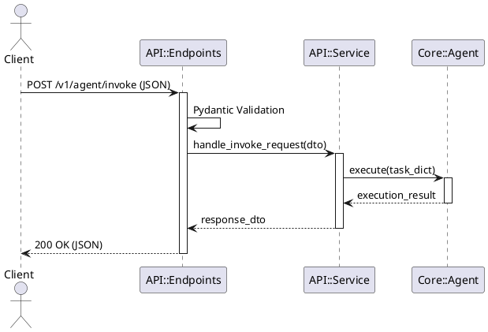
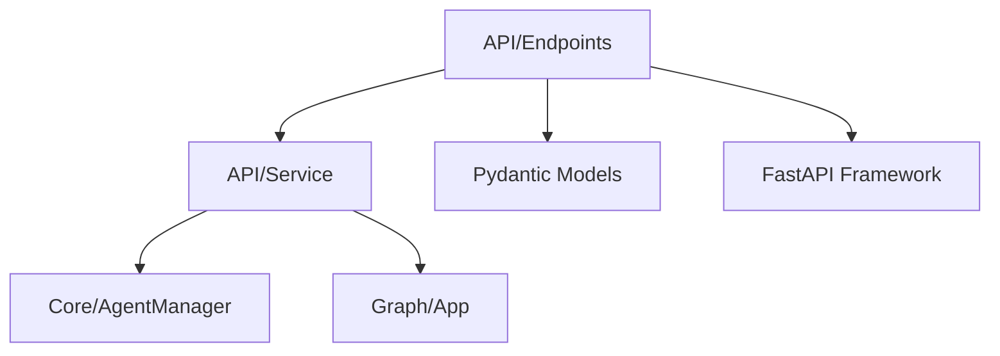

# Agents API 模块 (包装接口与服务暴露)

## 1. 目录定位与边界
`api/` 目录负责将底层的 Agent 能力通过 HTTP/RESTful 接口暴露给外部调用方（如前端 Web、其他微服务或外部客户端）。
**边界限制**：本目录**只负责**路由分发、请求参数校验、数据模型转换（DTO）和 HTTP 异常处理。**严禁**在 API 层编写复杂的业务逻辑或直接操作底层存储。

## 2. 核心类/函数清单及职责
| 文件 | 核心类/函数 | 职责说明 |
|---|---|---|
| `main.py` | `app` (FastAPI instance) | FastAPI 应用的全局初始化文件，负责注册中间件、异常处理器和跨域配置 (CORS)。 |
| `endpoints.py` | `router` (APIRouter) | 定义具体的 HTTP 路由规则，如 `/v1/chat/completions` 等接口入口。 |
| `service.py` | `APIService` | 桥接层，负责接收 HTTP 层的请求数据，转换后调用 `core` 模块中的具体 Agent 执行任务。 |

## 3. 交互时序图 (PlantUML)


## 4. 依赖关系图 (Mermaid)


## 5. 快速接入示例
外部调用 `/v1/agent/invoke` 接口的 Curl 示例：
```bash
curl -X POST "http://localhost:8001/v1/agent/invoke" \
     -H "Content-Type: application/json" \
     -d '{
           "agent_name": "data_agent",
           "task": "Analyze sales data for 2023",
           "session_id": "session-12345"
         }'
```

## 6. 本地调试步骤
1. 启动 FastAPI 服务：
   ```bash
   AGENT_PORT=8001 AGENT_RELOAD=true python -m agents.main
   ```
2. 访问 Swagger UI 接口文档：`http://localhost:8001/docs`。
3. 在 Swagger 界面中直接填入参数进行在线调试。

## 7. 单元测试执行命令
```bash
# 运行 api 目录下的集成与契约测试
pytest tests/test_api_integration.py tests/test_agents_api_contract.py -v
```

## 8. 性能基准指标
- **API 响应延迟 (P99)**: 排除 LLM 耗时，API 层纯转发开销 < 10ms
- **吞吐量**: 单节点 Uvicorn (4 Workers) 支持 ~2000 QPS (非阻塞型请求)

## 9. 常见错误排查表
| HTTP 状态码 | 错误现象 | 可能原因 | 解决建议 |
|---|---|---|---|
| `422 Unprocessable Entity` | 请求参数校验失败 | 传入的 JSON 格式不符合 Pydantic 模型定义 | 检查 `endpoints.py` 中对应的 Schema，确保必填字段完整且类型正确。 |
| `500 Internal Server Error` | 服务端异常 | 桥接层调用 Agent 失败或遇到未捕获的 Python 异常 | 查看后端控制台的 Uvicorn 报错栈，检查 Agent 初始化是否成功。 |
| `503 Service Unavailable` | LLM 请求超时 | 底层大模型提供商响应超时 | 调整客户端超时时间，或检查 `providers/` 的网络连通性。 |
