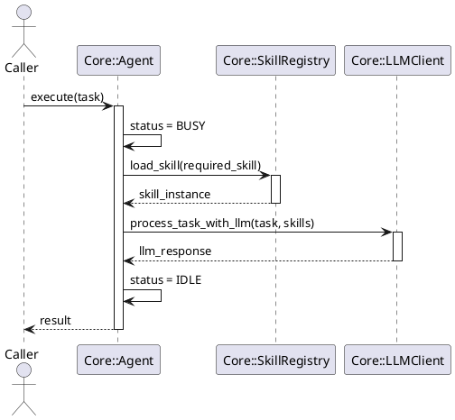
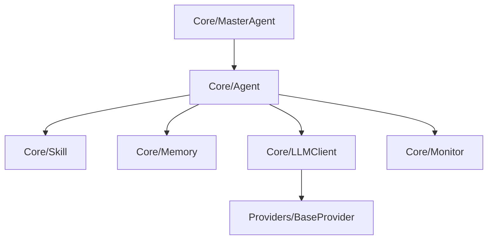

# Agents Core 模块 (核心基座)

## 1. 目录定位与边界
`core/` 目录是 Agents 服务的核心底座模块，负责定义 Agent 的抽象行为、通信协议、生命周期管理、技能注册机制以及大语言模型 (LLM) 的调用封装。
**边界限制**：本目录**不包含**任何具体的业务 Agent 实现（业务实现位于 `instances/` 或 `entries/`），也**不包含** HTTP 接口定义（位于 `api/`）。

## 2. 核心类/函数清单及职责
| 文件 | 核心类/函数 | 职责说明 |
|---|---|---|
| `agent.py` | `Agent` (ABC) | Agent 的抽象基类，提供生命周期管理（启动、停止、执行任务）、状态流转以及技能绑定能力。 |
| `llm.py` | `LLMClient` | 统一的 LLM 客户端接口，负责对底层大模型提供商进行标准化的请求/响应转换。 |
| `skill.py` | `Skill` (ABC) | 技能抽象类，规范了 Agent 可调用外部工具的标准输入输出结构。 |
| `monitor.py` | `AgentMonitor` | 监控埋点组件，负责记录 Agent 执行过程中的耗时、成功率、Token 消耗等指标。 |
| `collaboration.py` | `Coordinator` | 多 Agent 协作管理器，负责任务分发与结果聚合。 |
| `memory.py` | `MemoryManager` | 记忆管理模块，处理短时记忆和长时记忆的存储与检索。 |

## 3. 交互时序图 (PlantUML)


## 4. 依赖关系图 (Mermaid)


## 5. 快速接入示例
```python
from agents.core.agent import Agent
from agents.core.skill import Skill

class MyCustomAgent(Agent):
    async def process_task(self, task: dict) -> dict:
        # 你的业务逻辑
        return {"status": "success", "result": f"Processed {task['input']}"}

# 初始化并执行
agent = MyCustomAgent(name="Demo", description="Demo Agent")
result = await agent.execute({"input": "Hello World"})
print(result)
```

## 6. 本地调试步骤
1. 确保已配置环境变量 `.env`，包含 `LLM_API_KEY` 等核心配置。
2. 运行 Python 交互式环境 (REPL) 或编写 `debug.py` 引入对应类。
3. 开启 `DEBUG` 级别日志：`export LOG_LEVEL=DEBUG`。

## 7. 单元测试执行命令
```bash
# 运行 core 目录下的所有单元测试，并输出覆盖率
pytest tests/test_agent_system.py -v --cov=agents/core --cov-report=term-missing
```

## 8. 性能基准指标
- **单实例启动耗时**: < 5ms
- **状态流转开销**: < 0.1ms
- **并发能力**: 纯计算场景下单进程支持 > 1000 并发任务（协程调度）

## 9. 常见错误排查表
| 错误现象 | 可能原因 | 解决建议 |
|---|---|---|
| `Agent is stopped` | 调用 `execute` 时 Agent 状态已被置为 `STOPPED` | 检查是否误调用了 `agent.stop()`，需调用 `start()` 恢复。 |
| `Skill not found in registry` | 尝试加载未注册的技能 | 检查 `skills/` 目录下对应的技能是否正确继承了 `Skill` 并被 `@register` 装饰。 |
| `Memory limit exceeded` | 内存溢出 | `self.memory` 累积过多历史记录，考虑重写 `memory.py` 实现 LRU 清理。 |
