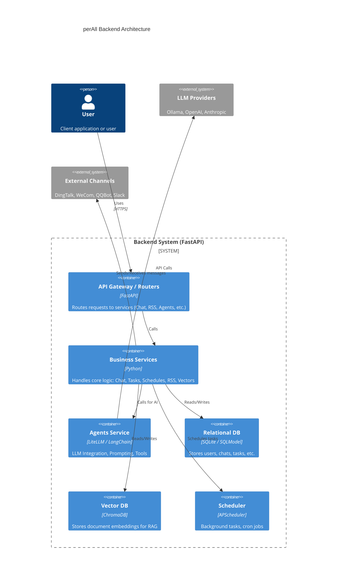
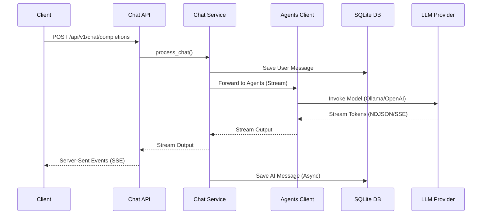
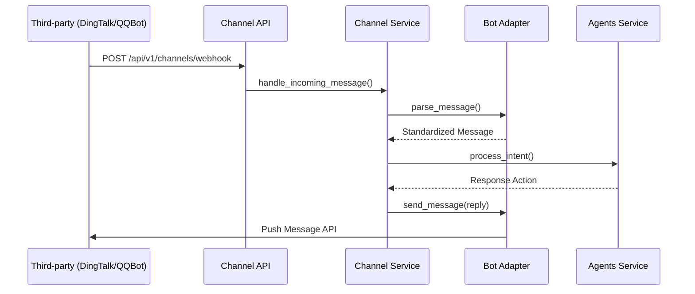

# 后端服务架构总览

## 一、整体技术架构图

## 二、主要服务列表

| 服务名称 | 职责描述 | 技术栈 | 默认端口 | 启动命令 | 健康检查端点 |
| --- | --- | --- | --- | --- | --- |
| **Main API Server** | 提供所有 RESTful API，处理前端与外部渠道请求 | FastAPI, SQLModel | 8000 | `python -m app.main` 或 `uvicorn app.main:app` | `/health` |
| **Agents Service** | 提供统一的大模型调用、工具编排与流式输出 | LiteLLM, LangGraph | - | 随主服务启动 | `/agents/health` |
| **Background Scheduler** | 处理定时任务（如内容生成、消息提醒、RSS 抓取） | APScheduler | - | 随主服务启动 | - |

## 三、核心依赖与中间件

- **Web 框架**: FastAPI (>=0.100.0)
- **ORM & 数据库**: SQLModel (>=0.0.8), SQLite (默认启用 WAL 模式以提升并发性能)
- **向量数据库**: ChromaDB (>=0.4.15) 与 Sentence-Transformers，用于本地 RAG 知识检索
- **任务调度**: APScheduler (>=3.10.1)，支持 cron 和 interval 任务
- **大语言模型层**: LiteLLM, LangGraph，支持多提供商 (Ollama, OpenAI, Anthropic)
- **网络与请求**: HTTPX (异步外部请求), BeautifulSoup4 & Feedparser (RSS抓取)

## 四、关键业务流程时序图

**1. AI 对话与流式响应流程**

**2. 外部渠道机器人消息推送流程 (Nanobot)**

## 五、目录结构说明与编码规范

- `app/api/`: REST API 路由层，按业务模块划分 (chat, rss, auth 等)。
- `app/core/`: 核心基础组件，包含数据库连接 (`database.py`)、日志配置 (`logging_config.py`)、身份认证、调度器 (`scheduler.py`) 以及多渠道适配器 (`channel/`)。
- `app/models/`: SQLModel 数据库模型定义层，映射到 SQLite 数据库表，负责数据结构。
- `app/services/`: 业务逻辑层，处理各模块的核心规则和流程。
- `app/service_client/`: 内部服务间通信客户端，如 `agents_client`。
- `data/`: 存放本地 SQLite 数据库文件、ChromaDB 向量数据以及上传的本地附件。
- `logs/`: 本地生成的滚动日志，支持磁盘不足时自动降级策略。
- `tests/`: 单元测试和集成测试目录。
- `scripts/`: 初始化和运维脚本 (如数据库结构补齐、种子数据生成等)。

**编码规范参考**: 遵循项目级强制规则（Python），所有类与函数必须包含详细的 Docstring（功能说明、入参、出参）；业务逻辑需带有分步注释；模型与字典必须包含键值注释。

## 六、环境变量清单、秘钥管理策略与 CI/CD

- **环境变量**:
  - `AGENTS_BASE_URL`: Agents 服务的内部地址（若微服务分离部署时使用）。
  - `KUBERNETES_SERVICE_HOST`: 探测容器环境的标识。
  - `AGENT_DATA_PATH`: Agent Center 的 agents 文件目录，默认值为 `<project_root>/agents/agents`。
  - `SKILL_DATA_PATH`: Agent Center 的 skills 文件目录，默认值为 `<project_root>/agents/skills`。
- **秘钥管理策略**:
  - 大模型 API Keys 统一收口在 `model-config.json` 或 `.env` 中，不在代码库中明文提交。
  - 外部渠道 (DingTalk, QQBot, WeCom) 的 webhook 密钥及 Token 等敏感信息均保存在数据库中或 JSON 扩展字段中进行管理。
- **CI/CD 流水线概览**:
  - 支持本地通过 `uvicorn` 热重载开发。
  - 日志系统已兼容容器环境（检测到 `/.dockerenv` 时自动将日志输出至 Console 方便收集）。
  - 新增 `agent-center-integration` 流水线：并行启动 backend 与 frontend dev-server 后执行 Agent Center 集成断言。

## 八、Agent Center 文件数据源部署说明

- **数据源目录**:
  - `AGENT_DATA_PATH` 指向 agents 文件根目录（默认 `agents/agents`）。
  - `SKILL_DATA_PATH` 指向 skills 文件根目录（默认 `agents/skills`）。
- **加载行为**:
  - 服务启动时递归扫描目录下 `.json/.yaml/.yml/.js/.ts/.py/.md` 文件并聚合缓存。
  - 支持文件变更自动热更新；重复 `id` 返回 400；结构化文件解析失败返回 422。
  - 内部异常写入 `backend/logs/agent-center-error.log`，按天滚动并保留 30 天。
- **本地验证步骤**:
  - `cd backend && pip install -r requirements.txt`
  - `AGENT_DATA_PATH=/Users/sunjie/Documents/AI/perAll/agents/agents SKILL_DATA_PATH=/Users/sunjie/Documents/AI/perAll/agents/skills uvicorn app.main:app --host 0.0.0.0 --port 8000`
  - `curl "http://127.0.0.1:8000/api/v1/agent-center/agents?page=1&size=20"`
  - `curl "http://127.0.0.1:8000/api/v1/agent-center/skills?page=1&size=20"`
  - `cd frontend && pnpm dev --port 3000` 后访问 `http://localhost:3000/agent-center`。

## 七、可观测性方案

- **日志规范 (Logging)**:
  - 采用自定义 `DualRotatingDailyFileHandler` 进行按天和按大小双重轮转。
  - 核心日志分为 `application.log`, `error.log`, `access.log`，单文件最大 50MB，默认保留 30 天。
  - 支持 `TraceIdFilter` 进行全链路请求追踪，并统一采用 `JsonFormatter` 输出 JSON 格式日志。
  - 具备高可用设计：在磁盘空间不足（ENOSPC）时自动降级输出到控制台。
- **监控指标与告警 (Metrics & Alerts)**:
  - 提供 `/health` 与 `/agents/health` 端点用于探针检测与服务存活监控。
- **链路追踪 (Tracing)**:
  - 通过 `TraceIdMiddleware` 为每次请求自动注入 Trace ID，贯穿 API 层、Service 层及底层日志记录，确保复杂请求的可追溯性。
